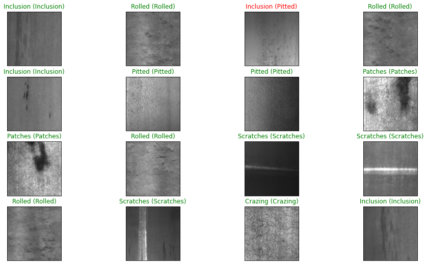

# Metal Surface Defect Inspection

## Project Information
**B.Tech Project Under Prof. Sukhomay Pal, IIT Guwahati**

This project was completed as part of the B.Tech curriculum at the Indian Institute of Technology, Guwahati under the guidance of Prof. Sukhomay Pal.

## Overview
This deep learning project focuses on classifying metal surface defects using images obtained from the NEU database, which encompasses six distinct defect types. The dataset, consisting of 1800 images, can be downloaded from [Kaggle](https://www.kaggle.com/fantacher/neu-metal-surface-defects-data). For successful implementation, it is crucial to organize the data into six folders, each containing 300 images. Once this setup is completed, executing the provided notebook in your data directory will yield comparable results.

## Methodology
- **Data Processing:** Processed 1,800+ images using Python (Pandas, NumPy) for cleaning, normalization, and augmentation
- **Model Training:** Trained CNN models using TensorFlow, leveraging transfer learning and L2 regularization
- **Testing and Validation:** Used Pytest for unit testing data pipelines and model inference code, ensuring reliability across experiments
- **Deployment:** Containerized the Python pipeline with Docker and exposed a Flask API for inference

## Results
- Achieved **95.83% accuracy** on the test dataset
- Successfully classified all six types of surface defects: Crazing, Inclusion, Patches, Pitted, Rolled, and Scratches

The model predictions and true categories for the metal surface defects are presented below:

- **Prediction (True Category)**
  - 

For a detailed visual representation, refer to the test results image provided in the repository.

## Technical Implementation

### Data Pipeline
1. **Data Collection:** Utilized the NEU metal surface defects dataset containing 1,800 images across 6 defect categories
2. **Preprocessing:** Implemented image normalization, resizing, and augmentation techniques
3. **Feature Engineering:** Applied various transformations to enhance model learning capability

### Model Architecture
1. **Base Models:** Leveraged pre-trained models through transfer learning for feature extraction
2. **Regularization:** Implemented L2 regularization to prevent overfitting
3. **Optimization:** Fine-tuned hyperparameters for optimal performance

### Deployment
1. **Containerization:** Docker container for consistent deployment across environments
2. **API Development:** Flask-based RESTful API for real-time inference
3. **Testing:** Comprehensive test suite using Pytest to ensure reliability

## Improving the Model
To enhance the model's performance, consider integrating transfer learning techniques. Transfer learning involves utilizing pre-trained models on large datasets and fine-tuning them for specific tasks. This can significantly boost the model's ability to accurately classify metal surface defects.

## Implementation
Follow these steps to integrate transfer learning into the project:

1. Download a pre-trained deep learning model suitable for image classification. Popular choices include models from the TensorFlow or PyTorch frameworks.
2. Modify the existing model architecture to incorporate the pre-trained model as the backbone.
3. Retrain the modified model on the metal surface defect dataset, adjusting the learning rate and other hyperparameters as needed.
4. Evaluate the performance of the transfer learning-enhanced model using appropriate metrics.

## Future Work
To further improve this project, consider the following potential areas for future work:

- **Data Augmentation:** Implement additional data augmentation techniques to increase the diversity of the training dataset, leading to a more robust model.
  
- **Hyperparameter Tuning:** Experiment with different hyperparameter configurations to optimize the model's performance.

- **Ensemble Learning:** Explore ensemble learning methods by combining predictions from multiple models, enhancing the overall classification accuracy.

- **Explainability:** Incorporate techniques for model interpretability to gain insights into the features influencing classification decisions.

- **Extended Dataset:** Continuously expand the dataset to encompass a broader range of metal surface defect scenarios, improving the model's generalization capabilities.

- **Object Detection:** Optimize the model by not only categorizing but also locating defects on the metal surface by considering using object detection models such as Faster R-CNN, YOLO, or SSD.

- **Anomaly Detection:** Explore Anomaly Detection Models if the defects on the metal surface are found to be rare or have diverse patterns.

## Unsupervised and Semi-Supervised Learning
While the current project focuses on supervised learning, future iterations could explore unsupervised or semi-supervised learning approaches. Unsupervised learning methods, such as clustering algorithms, can be employed to identify patterns and group similar images without labeled data. Additionally, semi-supervised learning techniques involve leveraging a small amount of labeled data along with a larger pool of unlabeled data, potentially enhancing model performance with limited labeled samples.

Feel free to contribute to these areas or explore new avenues for advancing the project.

